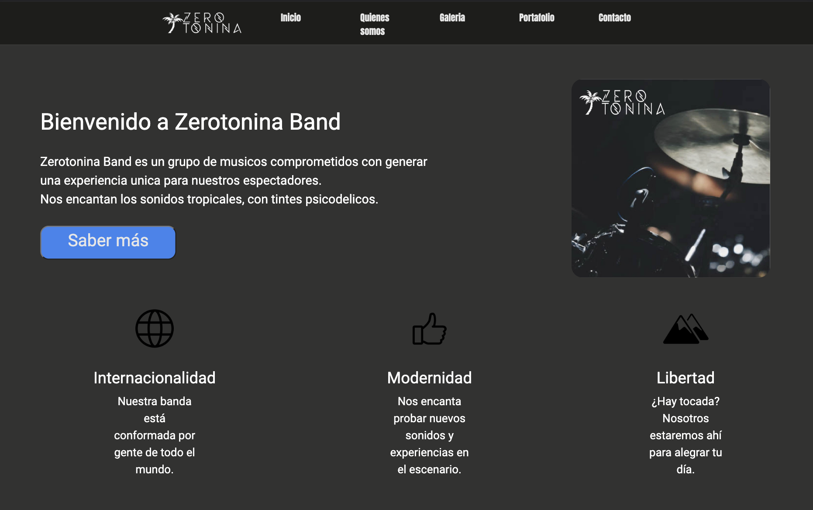

<div id="top"></div>


<!-- PROJECT LOGO -->
<br />
<div align="center">
  <a href="https://github.com/Feelshot/Zerotonina_SASS_CDRL/">
    
  </a>

  <h3 align="center">Proyecto CODERHOUSE</h3>

  <p align="center">
    Creacion de una pagina web estatica.
    <br />
    <a href="https://github.com/Feelshot/Zerotonina_SASS_CDRL/"><strong>Explore the docs »</strong></a>
    <br />
    <br />
    <a href="https://zerotonina-sass-cdrl.vercel.app/">View Demo</a>
    ·
    <a href="https://github.com/Feelshot/Zerotonina_SASS_CDRL/issues">Report Bug</a>
    ·
    <a href="https://github.com/Feelshot/Zerotonina_SASS_CDRL/issues">Request Feature</a>
  </p>
</div>


<!-- TABLE OF CONTENTS -->
<details>
  <summary>Table of Contents</summary>
  <ol>
    <li>
      <a href="#about-the-project">About The Project</a>
      <ul>
        <li><a href="#built-with">Built With</a></li>
      </ul>
    </li>
    <li>
      <a href="#getting-started">Getting Started</a>
      <ul>
        <li><a href="#prerequisites">Prerequisites</a></li>
        <li><a href="#installation">Installation</a></li>
      </ul>
    </li>
    <li><a href="#contributing">Contributing</a></li>
    <li><a href="#license">License</a></li>
    <li><a href="#contact">Contact</a></li>
    <li><a href="#acknowledgments">Acknowledgments</a></li>
  </ol>
</details>


<!-- ABOUT THE PROJECT -->
## About The Project



Maquetación de una pagina web para una banda de rock con CSS Grid, Flexbox, Boostrap y SASS. 

<p align="right">(<a href="#top">back to top</a>)</p>


### Built With

* ![HTML]
* ![CSS]


<p align="right">(<a href="#top">back to top</a>)</p>


<!-- GETTING STARTED -->
## Getting Started

To get a local copy up and running follow these simple example steps.

### Prerequisites

This is an example of how to list things you need to use the software and how to install them.
* npm
  ```sh
  npm install npm@latest -g
  ```

### Installation

_Below is an example of how you can instruct your audience on installing and setting up your app. This template doesn't rely on any external dependencies or services._

1. Get a free API Key at [https://example.com](https://example.com)
2. Clone the repo
   ```sh
   git clone https://github.com/your_username_/Project-Name.git
   ```
3. Install NPM packages
   ```sh
   npm install
   ```
4. Enter your API in `config.js`
   ```js
   const API_KEY = 'ENTER YOUR API';
   ```

<p align="right">(<a href="#top">back to top</a>)</p>


<!-- CONTRIBUTING -->
## Contributing

Contributions are what make the open source community such an amazing place to learn, inspire, and create. Any contributions you make are **greatly appreciated**.

If you have a suggestion that would make this better, please fork the repo and create a pull request. You can also simply open an issue with the tag "enhancement".
Don't forget to give the project a star! Thanks again!

1. Fork the Project
2. Create your Feature Branch (`git checkout -b <Nombre de la rama>`)
3. Commit your Changes (`git commit -m "mensaje del commit'`)
4. Push to the Branch (`git push origin branch`)
5. Open a Pull Request

<p align="right">(<a href="#top">back to top</a>)</p>


<!-- LICENSE -->
## License

Distributed under the [MIT](/LICENSE.txt) License. See `LICENSE.txt` for more information.

<p align="right">(<a href="#top">back to top</a>)</p>


<!-- CONTACT -->
## Contact

Dani Feelshot - feelshotmarketing@gmail.com

Project Link: [https://github.com/Feelshot/Zerotonina_SASS_CDRL/](https://github.com/Feelshot/Zerotonina_SASS_CDRL/)

<p align="right">(<a href="#top">back to top</a>)</p>


<!-- ACKNOWLEDGMENTS -->
## Acknowledgments

* [Flexbox](https://css-tricks.com/snippets/css/a-guide-to-flexbox/)
* [Grid](https://css-tricks.com/snippets/css/complete-guide-grid/)
* [Colores degradados](https://mycolor.space/gradient3)
* [Icons8](https://icons8.com/icons)
* [Google fonts](https://fonts.google.com/)
<p align="right">(<a href="#top">back to top</a>)</p>


<!-- MARKDOWN LINKS & IMAGES -->
